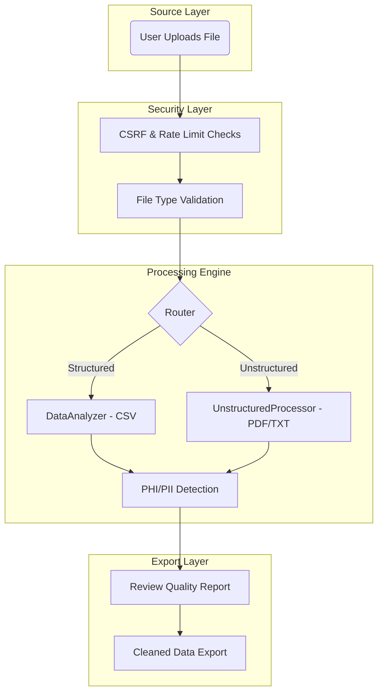

# Smart Data Cleaner: Project Flow Diagram

This document contains both a visual ASCII diagram and a Mermaid code block for the project workflow.

## 1. Visual Flow (ASCII Diagram)
```text
┌─────────────────┐
│ User Uploads    │
│ File (CSV/PDF)  │
└────────┬────────┘
         │
         ▼
┌─────────────────┐
│ Security Checks │
│ (CSRF/Rate Limit)│
└────────┬────────┘
         │
         ▼
┌─────────────────┐       ┌─────────────────┐
│   Structured    │◀─────▶│  Unstructured   │
│   (CSV/Excel)   │       │   (PDF/Text)    │
└────────┬────────┘       └────────┬────────┘
         │                         │
         └───────────┬─────────────┘
                     │
                     ▼
             ┌───────────────┐
             │ PHI/PII Scan  │
             │ (Compliance)  │
             └───────┬───────┘
                     │
                     ▼
             ┌───────────────┐
             │  Cleaned Data │
             │     Export    │
             └───────────────┘
```

## 2. Technical Workflow (Mermaid)



### Flow Summary:
1.  **Ingestion**: Files are uploaded and immediately checked for security risks (CSRF, Rate Limiting).
2.  **Routing**: The system detects if the data is **Structured** (CSV/Excel) or **Unstructured** (PDF/Text).
3.  **Processing**:
    -   Structured data is analyzed for quality issues (missing values, duplicates).
    -   Unstructured data is extracted via Docling/OCR.
4.  **Compliance**: All data passes through the PHI/PII scanner to identify sensitive health information.
5.  **Finalization**: User reviews the findings and exports a sanitized, compliant dataset.
